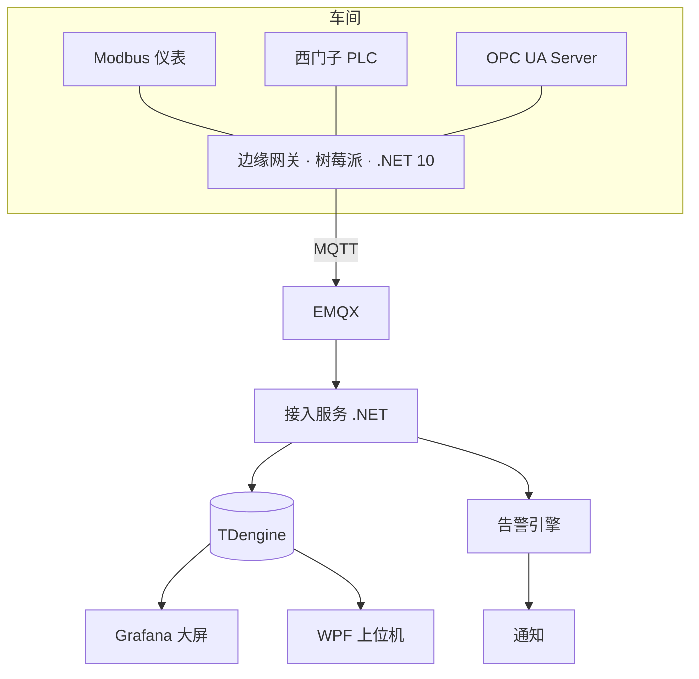

# W20 · 打磨与包装

> 题库: Q32
> 术语: OEE

**东西做完了不等于能拿去面试。** 这周把它变成一个别人五分钟内能看懂、能相信的作品。

## 开始之前

**这周做什么** — 把做完的东西变成别人五分钟内能看懂、能相信的作品。

**读完你能** — 拿出压测数字；不看图默画架构讲 5 分钟；交出演示视频。

**需要什么** — 整条链路已跑通。本周末是 M5 闸门。

**12 小时怎么分** — **200 设备压测 4h** · 架构图与默画练习 2h · README 2h · 一键部署 2h · **录演示视频 2h**

---

## 一、200 台设备模拟器（本周最有价值的一件事）

真实硬件只有两三台，但面试官会问"能扛多少设备"。**答"我压测过 200 台，CPU 40%，写入延迟 P99 是 120ms"和答"应该没问题"，是两个层级。**

```csharp
// 模拟器：起 N 个 Modbus TCP 从站，各自返回带随机游走的数据
for (var i = 0; i < 200; i++)
    _ = RunSlaveAsync(port: 15000 + i, unitId: 1, ct);
```

用 **Modbus TCP** 做模拟（不是 RTU）——RTU 需要虚拟串口对，麻烦且不好扩到 200。或者直接用 `pymodbus` 起一堆从站，更省事。

**要记录的数字**（这些就是你的面试弹药）：

| 指标 | 记什么 |
|---|---|
| CPU / 内存 | 稳态占用，以及峰值 |
| 采集周期达成率 | 设 1 秒，实际平均多少？P99 多少？ |
| MQTT 发布速率 | 条/秒 |
| TDengine 写入延迟 | 平均 / P99 |
| 端到端延迟 | 采集时刻 → 入库时刻 |
| 断网 10 分钟的积压与恢复时间 | |

**做一张压测结果表放进 README。** 有数字的项目和没数字的项目，可信度差一个数量级。

---

## 二、架构图：要能在白板上默画

用 draw.io 或 Mermaid 画一张，**然后练到不看图能默画**。M5 闸门的第二条就是这个。



**画图的原则**：
- **一张图只讲一件事**。总览图不要画到类的粒度。
- **标出协议**（箭头上写 MQTT / Modbus / OPC UA），这是工业架构图的信息密度所在。
- **标出边界**（车间 / 厂区 / 云），说明数据在哪穿越了网络。

**练习方法**：限时 5 分钟，白纸默画，然后对着原图找漏掉的部分。练 5 次。

---

## 三、README：写给面试官看

结构固定，**每一节都回答一个面试官心里的问题**：

| 章节 | 回答的问题 |
|---|---|
| 一句话简介 + 架构图 | 这是什么？ |
| **背景与目标** | 为什么做？解决什么真实问题？ |
| 硬件清单 + 照片 | 是真做的还是纸上谈兵？ |
| **技术选型理由** | 为什么是 TDengine 不是 InfluxDB？为什么自建不用 ThingsBoard？ |
| 部署步骤 | 别人能跑起来吗？ |
| **压测结果** | 能扛多少？ |
| **已知限制** | 你知道自己的边界吗？ |

**"已知限制"这一节是加分项，不是减分项。** 写上"当前单机部署，接入服务未做水平扩容验证"、"OPC UA 只实现了客户端订阅，未做历史访问（HA）"——**承认边界的人比声称什么都能做的人可信**。

---

## 四、一键部署

```yaml
# docker-compose.yml
services:
  emqx:      { image: emqx/emqx:latest, ports: ["1883:1883", "18083:18083"] }
  tdengine:  { image: tdengine/tdengine:latest, ports: ["6030:6030", "6041:6041"] }
  grafana:
    image: grafana/grafana:latest
    ports: ["3000:3000"]
    environment:
      GF_INSTALL_PLUGINS: tdengine-datasource
  ingest:    { build: ./src/Iiot.Ingest, depends_on: [emqx, tdengine] }
```

**验收**：在一台干净机器上 `git clone` + `docker-compose up`，**十分钟内**看到看板有数据（配合模拟器）。

**这一条比什么都能证明工程能力**——面试官如果真去 clone 了你的仓库，跑不起来就全白费。

---

## 五、演示视频（3–5 分钟）

**面试时直接放，比说十句都有用。** 脚本：

| 时间 | 内容 |
|---|---|
| 0:00–0:30 | 实物镜头：树莓派、485 线、温湿度变送器、PLC。**要拍到手** |
| 0:30–1:30 | 看板实时数据；用手捂住温度探头，曲线跟着涨 |
| 1:30–2:30 | **拔网线**（拍到手），本地缓冲行数在涨、内存平稳；插回，曲线从断点接上 |
| 2:30–3:30 | 上位机点按钮 → PLC 指示灯亮；写值的二次确认弹窗 |
| 3:30–4:00 | 触发一次超温告警，通知弹出 |
| 4:00–4:30 | 200 设备压测的资源占用截图 |

**"捂温度探头看曲线涨"和"手拔网线"是两个最有说服力的镜头**——它们无法伪造。

---

## 六、代码上传（注意脱敏）

传 GitHub 或 Gitee 前**逐项检查**：

- [ ] 没有真实 IP、账号、密码、密钥（用 `git log -p | grep -iE 'password|secret|token'` 扫一遍历史，不只是当前文件）
- [ ] 没有客户名称、厂区名称、产线名称
- [ ] 配置文件是示例值（`appsettings.Example.json`），真实配置进 `.gitignore`
- [ ] commit 邮箱不是你不想公开的那个（**可以用 GitHub 的 noreply 地址**）

**提交历史要看得过去**：面试官会翻。一个"initial commit"包含全部代码，说明你是最后一次性传上去的；有节奏的提交历史才像真的在做。

---

## 七、上线后客户说数据不对，怎么办（Q32）

**这是现场最高频的场景**，答案的结构比内容重要——**先定位在哪一段，再谈修**。

```
① 先问清楚"不对"是什么意思
   数值偏移？量纲错？时间对不上？还是完全不动？

② 分段验证，从设备侧往上游走
   设备本体   ← 用手持表 / 万用表直接量，和仪表显示对比
   协议层     ← 串口助手手发报文，看原始寄存器值
   驱动层     ← 日志里的原始字节 vs 解析后的值
   传输层     ← MQTT 抓包，看发出去的载荷
   存储层     ← 直接查 TDengine，看落库的值
   展示层     ← 看板的查询语句、单位、缩放

③ 最常见的四个原因（按概率）
   缩放系数错（255 应该是 25.5）
   字序错（32 位值乱码）
   地址错位（4xxxx 记法没减 1）
   时间戳错（用了平台时间，补传后曲线全挤在一起）

④ 有原始数据就能自证
   我在驱动层记录原始字节。客户说数据不对时，我能拿出
   "设备返回的原始报文是 01 03 04 00 FF 00 00 xx xx"，
   一起对一遍，责任和原因当场就清楚了。
```

**第 ④ 条是这题的题眼**：**保留原始数据**让你从"扯皮"变成"举证"。这个习惯是老手和新手的分水岭。

---

## 八、M5 闸门（本周末）

- [ ] **200 设备压测通过**，给得出资源占用数字
- [ ] **不看图能在白板上默画完整架构并讲 5 分钟**
- [ ] **演示视频完成**

---

## 延伸阅读

| 用途 | 链接 |
|---|---|
| draw.io（画架构图） | <https://app.diagrams.net/> |
| Mermaid（图存进 Git，可 diff） | <https://mermaid.js.org/> |
| Docker Compose（一键部署） | <https://docs.docker.com/compose/> |
| pymodbus（做 200 从站模拟器最省事） | <https://github.com/pymodbus-dev/pymodbus> |
